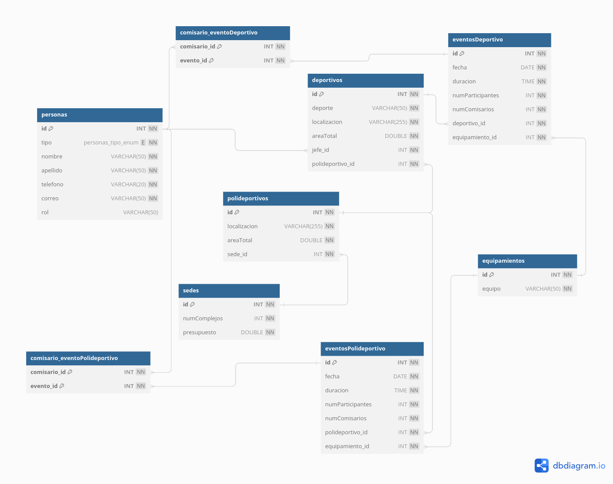

# Identificacion de entidades y atributos

1. **sedes**

- id (PK)
- numComplejos (INT)
- presupuesto (DOUBLE)

2. **polideportivos**

- id (PK)
- localizacion (VARCHAR 255)
- areaTotal (DOUBLE)
- sede_id (INT, FK)

3. **personas**

- id (PK)
- tipo (ENUM)
- nombre (VARCHAR 50)
- apellido (VARCHAR 50)
- telefono (VARCHAR 50, UC)
- correo (VARCHAR 50, UC)
- rol (VARCHAR 50)

4. **deportivos**

- id (PK)
- deporte (VARCHAR 50, UC)
- localizacion (VARCHAR 255)
- areaTotal (DOUBLE)
- jefe_id (INT, FK)
- polideportivo_id (INT, FK)

5. **equipamientos**

- id (PK)
- equipo (VARCHAR 50, UC)

6. **eventosDeportivo**

- id (PK)
- fecha (DATE)
- duracion (TIME)
- numParticipantes (INT)
- numComisarios (INT)
- deportivo_id (INT, FK)
- equipamiento_id (INT, FK)

7. **eventosPolideportivo**

- id (PK)
- fecha (DATE)
- duracion (TIME)
- numParticipantes (INT)
- numComisarios (INT)
- polideportivo_id (INT, FK)
- equipamiento_id (INT, FK)

8. **comisario_eventoDeportivo**

- comisario_id (INT, FK)
- evento_id (INT, FK)

9. **comisario_eventoPolideportivo**

- comisario_id (INT, FK)
- evento_id (INT, FK)

# Imagen "Modelo Fisico"



# Consultas

1. Consulta de Todos los Eventos en un Complejo Deportivo Específico:

    ```sql
    SELECT * FROM eventosDeportivo WHERE deportivo_id = 1;
    ```

2. Consulta de Comisarios Asignados a un Evento en Particular

    ```sql
    SELECT p.nombre AS nombre_comisario , p.apellido AS apellido_comisario, e.*
    FROM personas p
    JOIN comisario_eventoDeportivo c ON p.id = c.comisario_id
    JOIN eventosDeportivo e ON c.evento_id = e.id
    WHERE tipo = "comisario" AND e.id = 2;
    ```

3. Consulta de Todos los Eventos en un Rango de Fechas

    ```sql
    SELECT * FROM eventosDeportivo WHERE fecha BETWEEN '2023-09-28' AND '2023-12-10'
    UNION ALL
    SELECT * FROM eventosPolideportivo WHERE fecha BETWEEN '2023-09-28' AND '2023-12-10';

    ```

4. Consulta del Número Total de Comisarios Asignados a Eventos

    ```sql
    SELECT SUM(numComisarios) AS totalComisarios
    FROM (
        SELECT numComisarios FROM eventosDeportivo
        UNION ALL
        SELECT numComisarios FROM eventosPolideportivo
    ) AS comisariosTotales;
    ```

5. Consulta de Complejos Polideportivos con Área Total Ocupada Superior a un Valor Específico

    ```sql
    SELECT * FROM polideportivos WHERE areaTotal > 200;
    ```

6. Consulta de Eventos con Número de Participantes Mayor que la Media

    ```sql
    SELECT * FROM (
        SELECT * FROM eventosPolideportivo WHERE numParticipantes > (
        SELECT AVG(numParticipantes) FROM eventosPolideportivo
        )
        UNION ALL
        SELECT * FROM eventosDeportivo WHERE numParticipantes > (
        SELECT AVG(numParticipantes) FROM eventosDeportivo
    )) AS eventosMayorMedia;
    ```

7. Consulta de Equipamiento Necesario para un Evento Específico

    ```sql
    SELECT equipo AS equipo_necesario, ed.* FROM equipamientos e
    JOIN eventosDeportivo ed ON e.id = ed.equipamiento_id
    WHERE ed.id = 2;
    ```

8. Consulta de Eventos Celebrados en Complejos Deportivos con Jefe de Organización Específico

    ```sql
    SELECT e.* FROM eventosDeportivo e
    JOIN deportivos d ON e.deportivo_id = d.id
    JOIN personas p ON d.jefe_id = p.id
    WHERE p.id = 1 AND p.tipo = "jefe";
    ```

9. Consulta de Complejos Polideportivos sin Eventos Celebrados

    ```sql
    SELECT p.* FROM polideportivos p
    LEFT JOIN eventosPolideportivo e ON p.id = e.polideportivo_id
    WHERE e.polideportivo_id IS NULL;
    ```

10. Consulta de Comisarios que Actúan como Jueces en Todos los Eventos

    ```sql
    SELECT * FROM personas WHERE tipo = "comisario" AND rol = "juez";
    ```

## Uso del Proyecto

Clona este repositorio en tu maquina local:

```BASH
git clone https://github.com/jstorra/OlimpiadaEvaluacion.git
```

---

<p align="center">Developed by <a href="https://github.com/jstorra">@jstorra</a></p>